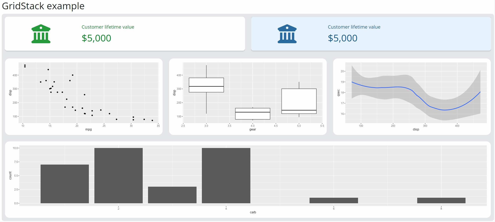

# gridstackr

<!-- badges: start -->
[](https://lifecycle.r-lib.org/articles/stages.html#experimental)
<!-- badges: end -->

Create movable and resizable grid layout in Shiny application. Powered by the JavaScipt library [gridstack.js](https://github.com/gridstack/gridstack.js).


## Installation

You can install the development version of gridstackr from [GitHub](https://github.com/dreamRs/gridstackr) with:

```r
# install.packages("remotes")
remotes::install_github("dreamRs/gridstackr")
```


## Example




```r
library(shiny)
library(bslib)
library(ggplot2)
library(gridstackr)

ui <- page_fluid(
  tags$h2("GridStack example"),
  gridstack(
    margin = "10px",
    cellHeight = "140px",
    float = TRUE,
    gs_item(value_box(
      title = "Customer lifetime value",
      value = "$5,000",
      showcase = icon("bank"),
      theme = "text-success",
      class = "mb-0"
    ), w = 6, h = 1),
    gs_item(value_box(
      title = "Customer lifetime value",
      value = "$5,000",
      showcase = icon("bank"),
      theme = value_box_theme(bg = "#e6f2fd", fg = "#0B538E"),
      class = "border mb-0"
    ), w = 6, h = 1),
    gs_item(
      plotOutput("plot1", height = "100%"),
      w = 4, h = 2, class_content = "bg-white p-2 border rounded-4"
    ),
    gs_item(
      plotOutput("plot2", height = "100%"),
      w = 4, h = 2, class_content = "bg-white p-2 border rounded-4"
    ),
    gs_item(
      plotOutput("plot3", height = "100%"),
      w = 4, h = 2, class_content = "bg-white p-2 border rounded-4"
    ),
    gs_item(
      plotOutput("plot4", height = "100%"),
      w = 12, h = 2, class_content = "bg-white p-2 border rounded-4"
    )
  )
)

server <- function(input, output, session) {

  output$plot1 <- renderPlot({
    ggplot(mtcars) + geom_point(aes(mpg, disp))
  })
  output$plot2 <- renderPlot({
    ggplot(mtcars) + geom_boxplot(aes(gear, disp, group = gear))
  })
  output$plot3 <- renderPlot({
    ggplot(mtcars) + geom_smooth(aes(disp, qsec))
  })
  output$plot4 <- renderPlot({
    ggplot(mtcars) + geom_bar(aes(carb))
  })

}

if (interactive())
  shinyApp(ui, server)
```


## Development

This package use [{packer}](https://github.com/JohnCoene/packer) to manage JavaScript assets, see packer's [documentation](https://packer.john-coene.com/#/) for more.

Install nodes modules with:

```r
packer::npm_install()
```

Modify `srcjs/widgets/gridstack.js`, then run:

```r
packer::bundle()
```

Re-install R package and try `gridstack()` function.


